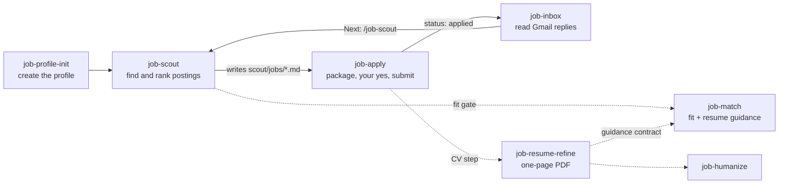

Twelve agent skills that run a job search end to end: find postings, rank them
against your profile, tailor a one-page resume, fill and submit the application,
and track replies in Gmail. The skills hold the procedure. Your facts (salary
band, work authorization, experience) live in a profile directory you control,
default `${XDG_CONFIG_HOME:-~/.config}/job-kit`, and never enter this repo.
A dashboard at [r1cco.com/jobs](https://r1cco.com/jobs/) reads the same dossiers
in the browser; its source is under `app/`.

Scout and apply need a browser. Run them in [Aside Browser](https://aside.com),
or in a coding agent (Claude Code, Codex, Grok, Hermes Agent) that drives your
own Chrome through the local [browser-use](https://docs.browser-use.com) CLI.
The other skills run in those coding agents, and most of them in Aside too.

## The loop

Scout writes one dossier per posting that passes its gates. Apply works through
the `status: new` dossiers one at a time and submits only after your yes. Inbox
reads Gmail, updates each dossier's status, and points you back to scout.



Around the loop: `job-list` reads the dossiers as stored, `job-match` re-ranks
them or analyzes one named dossier and adds read-only resume guidance,
`job-profile-me` edits what scout searches for, and
`job-stories` feeds `job-pitch`, which also ends in `job-humanize`.

Scout never applies, messages, or connects. It may use a session you are
already signed into; account creation, signup terms, passwords, and
verification stay with you. Apply skips a posting whose ad sits behind a login
wall, and a captcha at submit hands the filled form back to you.

## Skills

| Skill               | What it does                                                                                 | Writes                                                                            | Runs in                                   |
| ------------------- | -------------------------------------------------------------------------------------------- | --------------------------------------------------------------------------------- | ----------------------------------------- |
| `job-scout`         | Runs the search packs you pick, or a site URL, and ranks the postings it finds               | `scout/jobs/*.md` dossiers                                                        | Aside, or a coding agent with browser-use |
| `job-apply`         | Reads the dossier and the live ad, fills the form from your facts, submits on yes            | Dossier `status:` and Application log                                             | Aside, or a coding agent with browser-use |
| `job-prep`          | Prepares packages offline: revalidates the ad, reads the form, tailors the CV, never submits | `scout/applications/{slug}/plan.json` and `package.md`; a `posting dead` log line | Aside, or a coding agent with browser-use |
| `job-resume-refine` | Tailors one resume page to one posting from facts already in the profile                     | `scout/applications/{slug}/` PDF and match report                                 | Aside, coding agents                      |
| `job-inbox`         | Searches Gmail for replies to open applications and records the outcome                      | Dossier `status:` when evidence is strong                                         | Aside, coding agents                      |
| `job-list`          | Prints the dossiers on disk with their score and status                                      | Nothing                                                                           | Aside, coding agents                      |
| `job-match`         | Re-ranks stored dossiers, one named dossier, or a pasted posting and reports resume evidence | Nothing                                                                           | Aside, coding agents                      |
| `job-profile-init`  | Creates a new profile, or registers an existing one                                          | The profile tree, plus pointer files on Activate                                  | Coding agents                             |
| `job-profile-me`    | Shows the profile and edits positions, locations, boards, and CV settings                    | `data/job_search.yaml`, `search_packs.yaml`, `profile_card.yaml`, `cvs.yaml`      | Aside, coding agents                      |
| `job-profile-root`  | Resolves the absolute profile path for every other skill                                     | Nothing                                                                           | Aside, coding agents                      |
| `job-store`         | Resolves dossier schema, persistence lock, and untrusted-read law                            | Nothing                                                                           | Aside, coding agents                      |
| `job-stories`       | Writes and audits the interview story deck                                                   | `data/stories/*.md`                                                               | Coding agents                             |
| `job-pitch`         | Turns the story deck into a vetting video script or work-experience bullets                  | Nothing                                                                           | Aside, coding agents                      |
| `job-humanize`      | Rewrites drafted resume or pitch prose so it reads like you, keeping every claim             | Nothing                                                                           | Aside, coding agents                      |

Every skill writes only after it prints a diff or a package and you say yes.
Coding-agent skills land at `<agent home>/skills/<skill>`; Aside copies land in
`~/.aside/u/0/skills/builtin/`.

## Install

One command, no clone. It caches the kit at `~/.local/share/job-kit` and runs
the channel installers from there:

```bash
curl -fsSL https://raw.githubusercontent.com/rafaeelricco/job-kit/main/scripts/remote.sh | bash -s -- all
```

Read it first if you prefer:

```bash
curl -fsSL https://raw.githubusercontent.com/rafaeelricco/job-kit/main/scripts/remote.sh -o remote.sh
bash remote.sh all
```

| Argument       | Installs                                                                                                                                                                                                                                                  |
| -------------- | --------------------------------------------------------------------------------------------------------------------------------------------------------------------------------------------------------------------------------------------------------- |
| `all`          | All three channels; an absent target is skipped, not an error. Fails only if all are absent (default)                                                                                                                                                     |
| `aside`        | `job-scout` + `job-apply` + `job-prep` + `job-resume-refine` + `job-profile-me` + `job-list` + `job-match` + `job-pitch` + `job-inbox` + `job-humanize` + `job-profile-root` + `job-store` (fails if no Aside)                                            |
| `agents`       | `job-profile-init` + `job-profile-me` + `job-list` + `job-match` + `job-stories` + `job-pitch` + `job-inbox` + `job-humanize` + `job-profile-root` + `job-store` + `job-resume-refine` (fails if no agent home)                                           |
| `browser-use`  | `job-scout` + `job-apply` + `job-prep` + `job-resume-refine` + `job-match` + `job-list` + `job-profile-me` + `job-profile-root` + `job-store` + `job-humanize` plus the browser-use driver skill into agent homes; missing CLI or browser prints an offer |
| `fetch`        | Nothing. Refreshes the cached checkout only                                                                                                                                                                                                               |
| `uninstall`    | See [Uninstall](#uninstall)                                                                                                                                                                                                                               |
| `-h`, `--help` | Nothing. Prints usage                                                                                                                                                                                                                                     |

Options after the argument are forwarded to the installer. `all` forwards only
`--force`; use an explicit channel for the skip flags:

```bash
curl -fsSL https://raw.githubusercontent.com/rafaeelricco/job-kit/main/scripts/remote.sh | bash -s -- agents --skip-codex
```

| Knob                                                               | Default                  | Role                                                              |
| ------------------------------------------------------------------ | ------------------------ | ----------------------------------------------------------------- |
| `--force`                                                          | off                      | Replace a foreign (non-kit) destination                           |
| `--skip-claude` / `--skip-codex` / `--skip-grok` / `--skip-hermes` | off                      | Skip one agent target                                             |
| `JOB_KIT_HOME`                                                     | `$XDG_DATA_HOME/job-kit` | Cached checkout                                                   |
| `JOB_KIT_REF`                                                      | `main`                   | Branch or tag                                                     |
| `JOB_KIT_SLUG`                                                     | `rafaeelricco/job-kit`   | GitHub `owner/repo`                                               |
| `ASIDE_ACCOUNT`                                                    | `0`                      | Aside account profile                                             |
| `ASIDE_SKILLS`                                                     | none                     | Custom Aside builtin root, absolute (legacy: `ASIDE_SKILLS_USER`) |
| `CLAUDE_SKILLS`                                                    | none                     | Single absolute agent dest; skip flags ignored                    |

Re-runs are safe: kit-owned destinations re-sync, foreign ones fail unless you
pass `--force`. Uses `git` when present (shallow clone, shallow fetch on
re-run), otherwise `curl`/`wget` + `tar`. Run as your normal user, not with
`sudo`.

### Windows 11

Aside Browser is not available on Windows. Native scripts install the agents
and browser-use channels only (`all` means those two).

```powershell
# download then run (ExecutionPolicy Bypass is required on a default Win11 box)
Invoke-RestMethod https://raw.githubusercontent.com/rafaeelricco/job-kit/main/scripts/remote.ps1 -OutFile remote.ps1
powershell -ExecutionPolicy Bypass -File remote.ps1 all
```

| Argument      | Installs                                                                                              |
| ------------- | ----------------------------------------------------------------------------------------------------- |
| `all`         | agents + browser-use; skip if no agent home (default)                                                 |
| `agents`      | coding-agent skills (fails if no agent home)                                                          |
| `browser-use` | job-scout + job-apply + job-prep + shared deps + driver skill; missing CLI or browser prints an offer |
| `fetch`       | refresh the cached checkout only                                                                      |
| `uninstall`   | agents + browser-use skills (not profile data); `--purge` also drops the cache                        |

Local checkout: `powershell -ExecutionPolicy Bypass -File scripts\install.ps1` (menu, or `agents` / `browser-use` / `all`). Uninstall: `scripts\uninstall.ps1`. Cache default is `%USERPROFILE%\.local\share\job-kit` (same tree Git Bash uses when `HOME` is `%USERPROFILE%`). Skill dests are directory junctions into that cache, so keep it.

Git Bash + the `.sh` scripts still work, including the Aside channel if you later have Aside.

Keep the cached checkout in place: coding-agent skills symlink into it, and
Aside re-installs read it to prove kit ownership.

These scripts install skill trees and nothing else: no profile, no salary or
work-auth data, no login to any service.

## Getting started

**1. Create or register a profile.** Install the agents channel, then run the
skill in Claude Code, Codex, Grok, or Hermes Agent:

```text
/job-profile-init
```

It routes between creating a new profile and registering an existing one, asks
every user-owned profile field, then presents one plan of everything it will
write and waits for your yes. Source values and template defaults require
explicit confirmation, edits, or skips. Facts are never invented; final extra
observations land in `data/observations.yaml`.

No demographic or EEO self-identification is stored. Those questions are
voluntary and per-employer, so you answer them in the ATS form.

**2. Scout and apply.** Pick a runtime for the two browser skills: install the
Aside channel and run them in Aside Browser, or install the `browser-use`
channel and run them in Claude Code, Codex, Grok, or Hermes Agent, where the
local browser-use CLI drives your own Chrome. Either way:

```text
/job-scout
/job-apply
```

The browser-use channel is local only: your own signed-in browser over CDP,
with no Browser Use account, no cloud browser, and no API key. It needs an
agent home, the `browser-use` CLI, a Chromium-family browser, and the
browser-use driver skill in that home. When the CLI is present, the installer
runs `browser-use skill install` into each home (`--target claude`,
`--target agents`, `--path ~/.grok/skills/browser-use`,
`--path ~/.hermes/skills/browser-use`; `CLAUDE_SKILLS` also uses `--path`).
Missing CLI or browser still prints an offer. After that: open
`chrome://inspect/#remote-debugging`, tick Allow remote debugging, and sign in
to the sites you scout.

Scout runs the packs you pick from your profile's `data/search_packs.yaml`, or
an ad-hoc site URL you pass, and ranks the job rows it extracts. Apply queues
postings through job-list and takes them one at a time: it reads the dossier
and the live ad, resolves the CV, fills the form from profile Facts, and prints
a package for you to review; on your yes it submits and records.

Scout writes one dossier per persist-set row (live, gate, `score` > 7, match ≥70) to
`scout/jobs/{first_seen}-{company}--{title}.md`. That is the only path scout
writes; chat lists those dossiers by score (high to low).
`data/` and `cv/` stay read-only to it. Set `status:` in a dossier's frontmatter
as you apply. job-apply changes `new` to `applied` after confirmed submission
(or once you confirm you submitted outside it), preserves an existing advanced
lifecycle status, and records the package under the dossier's Application log.
Later statuses (`interview`, `offer`, `rejected`) are set by `/job-inbox` from
Gmail when evidence is strong; `dropped` stays yours.
Re-running scout never overwrites `status:`, and never renames the file.

You paste `/job-scout` and `/job-inbox` yourself. Inside `/job-apply`, the CV
step may chain `job-resume-refine`, and the last posting chains `job-inbox`
for the dossiers it just recorded. Run `/job-inbox` on its own to refresh the
whole board.

Each application carries exactly one CV PDF that opens. For a `status: new`
dossier, job-apply's CV step chains `/job-resume-refine` when `data/cvs.yaml`
`adapt_per_vacancy` is true (absent means true) and carries the single
`scout/applications/{slug}/*_Resume.pdf` (`Nome_Sobrenome_Cargo_Resume.pdf`)
only when `match-report.md` prints `verdict: **PASS**` (`{slug}` is that
dossier filename minus `.md`). A refine STOP or FAIL falls through to a leftover
PASS `*_Resume.pdf` in that `{slug}` dir, then to the base. A posting that prints
it is not accepting applications is skipped before that chain.
`adapt_per_vacancy: false` skips the chain and the leftovers; carry the base
instead. The base is `data/cvs.yaml` `base`; with no `data/cvs.yaml` it is
`cv/en-us-resume.pdf`. The package's `### CV` prints the pick and why. With
neither a resolvable PDF that posting is skipped. `/job-profile-me cvs`
still edits that file: it sets the base CV and the per-vacancy refinement
toggle. Standalone `/job-resume-refine` remains valid.

`/job-resume-refine` needs a LaTeX base under `cv/`, the `.tex` sibling of
the `data/cvs.yaml` `base` PDF. It copies that file whole and tailors roles,
bullets, Skills, and the Summary from profile Facts. Without a `.tex` it
stops and names the path it wanted.

**3. Tune the search.** Day-2 edits on a profile that already exists, in Aside
or a coding agent:

```text
/job-profile-me
```

`show` prints the profile, `gaps` names what still blocks a useful scout, and
`set` / `packs add` / `packs remove` change positions, locations,
and boards. It writes only `data/job_search.yaml`, `data/search_packs.yaml`, and
`data/profile_card.yaml`. Everything else under the profile is read-only here,
nothing is written before it prints a diff and you say yes, and it makes no
network calls.

**4. Read back what scout saved.** In Aside or any coding-agent session:

```text
/job-list
```

Resolves your Profile root, prints `scout/jobs/`, and answers from the dossiers
already on disk. It never writes one.

**5. Check replies on their own.** `/job-apply` already runs this leg at the end
of every run that submitted something. Run it standalone when you have not
applied to anything today and just want the board refreshed, in Aside or any
coding-agent session:

```text
/job-inbox
```

Default searches Gmail for companies of open applications (`applied` / `interview` / `offer`) only, with no inbox-wide keyword sweep. `/job-inbox all` adds every parseable dossier except `dropped` and the keyword sweep. Named company, title, or one or more files is those dossiers only. Opens surviving threads, and writes frontmatter `status:` plus one Application-log line (`— job-inbox`) when match and outcome are strong. Ambiguous mail is skipped, not asked. It never sends mail and never creates a dossier from unmatched recruiters.

An apply session with no Gmail transport stops the inbox leg and says so. The
application is recorded either way, and you can run `/job-inbox` later from a
session that has one.

## Profile root

Skills resolve the active profile in this order:

1. `$PROFILE_ROOT`, if that directory has `data/candidate.yaml` and
   `data/job_search.yaml`
2. `$HOME/.config/profile-root` (one absolute path line), same probe. An explicit
   Activate/install wins over path convention
3. **Aside:** host home's `~/.config/profile-root` when dual-home applies
4. Default config dirs (same probe, each not already tried):
   - `${XDG_CONFIG_HOME:-$HOME/.config}/job-kit`
   - Host-default fallback `$HOST_HOME/.config/job-kit` when that differs
     (Aside dual-home uses host home; always probed so host-default profiles
     resolve across XDG and non-XDG environments without a pointer)
5. Walk the session CWD upward until both probe files exist
6. Otherwise stop and name what was tried

`/job-profile-init` **Activate** sets durable pointers for non-host-default
paths (including XDG-only defaults). Host-default `$HOST_HOME/.config/job-kit`
is path convention. Without the skill: create/move the tree there, or write the
absolute profile path as the single line of `~/.config/profile-root`.

| File                                                  | Who reads it                                     |
| ----------------------------------------------------- | ------------------------------------------------ |
| `${XDG_CONFIG_HOME:-$HOME/.config}/job-kit`           | Default profile root (direct probe)              |
| `$HOST_HOME/.config/profile-root`                     | Coding agents; Aside dual-home step (legacy)     |
| `$HOST_HOME/.aside/runtime/home/.config/profile-root` | Aside when sandboxed `$HOME` is the runtime home |

`PROFILE_ROOT` is a session override only, because Aside does not inherit env
from the init session:

```bash
PROFILE_ROOT=/path/to/other-profile
```

Aside must be allowed to read that directory. A correct pointer to a
sandbox-blocked path still fails; grant FS access or move the profile to an
allowed location.

## Update

Remote install: re-run the same one-liner. It refreshes the cached checkout and
re-runs the installers. Local checkout: `git pull`, then re-run the installers
you use. Channels are independent.

Update never modifies profile checkouts, the default config dir contents, or
`~/.config/profile-root`. Installs
also clear kit-owned copies of legacy skill names (`job-discovery`, `job-application`,
`profile-scaffold`, `application-stage`, `profile-init`) and leftover kit trees
under Aside's `skills/user/`.

## Uninstall

One script, interactive pick or explicit targets. Every run prints a plan of
exactly what it will remove before it removes anything:

```bash
bash scripts/uninstall.sh
# from cache after a remote install:
bash "${JOB_KIT_HOME:-${XDG_DATA_HOME:-$HOME/.local/share}/job-kit}/scripts/uninstall.sh"
```

| Choice / target | Removes                                                                                                                                                                                                                    |
| --------------- | -------------------------------------------------------------------------------------------------------------------------------------------------------------------------------------------------------------------------- |
| Aside           | `job-scout` + `job-apply` + `job-prep` + `job-resume-refine` + `job-profile-me` + `job-list` + `job-match` + `job-pitch` + `job-inbox` + `job-humanize` + `job-profile-root` + `job-store` kit copies                      |
| Agents          | `job-profile-init` + `job-profile-me` + `job-list` + `job-match` + `job-stories` + `job-pitch` + `job-inbox` + `job-humanize` + `job-profile-root` + `job-store` + `job-resume-refine` kit links (+ legacy `profile-init`) |
| browser-use     | `job-scout` + `job-apply` + `job-prep` kit links, the browser-use driver skill, the CLI (`uv tool uninstall`), and `~/.config/browser-harness`. Never your browser                                                         |
| Profile         | `${XDG_CONFIG_HOME:-~/.config}/job-kit` (+ host-default if different) and matching pointer files                                                                                                                           |
| Cache           | Cached checkout at `JOB_KIT_HOME`                                                                                                                                                                                          |
| **All**         | Aside + agents + browser-use + **profile** + cache                                                                                                                                                                         |

Only kit-owned skill paths are removed. Foreign skills stay. A plan containing
profile or cache data requires typing `yes`; a plan of re-installable links takes
`[Y/n]`. `--yes` skips both, `--dry-run` prints the plan and stops.

`--only` selects a subset instead of positional targets: by channel (`aside`,
`agents`, `browser-use`), by Aside skill (`job-scout`, `job-apply`, `job-prep`,
`job-resume-refine`, `job-profile-me`, `job-list`, `job-match`, `job-pitch`,
`job-inbox`, `job-humanize`, `job-profile-root`, `job-store`), or by agent home
(`claude`, `codex`, `grok`, `hermes`), plus `profile` and `cache`. An Aside skill subset
cannot be combined with `cache`: the unselected skill would still point at it.

```bash
bash scripts/uninstall.sh --only claude,job-scout --dry-run
```

Curl / non-interactive skills-only (does not delete profile data):

```bash
curl -fsSL https://raw.githubusercontent.com/rafaeelricco/job-kit/main/scripts/remote.sh | bash -s -- uninstall
# skills + kit cache:
curl -fsSL https://raw.githubusercontent.com/rafaeelricco/job-kit/main/scripts/remote.sh | bash -s -- uninstall --purge
```

`uninstall agents` and `uninstall browser-use` via remote still accept
`--skip-claude` / `--skip-codex` / `--skip-grok` / `--skip-hermes`. `--purge` is full-skills
uninstall only (refused on partial targets or while `CLAUDE_SKILLS` /
`ASIDE_SKILLS` narrow a channel).

Windows 11 (no Aside): `powershell -ExecutionPolicy Bypass -File scripts\uninstall.ps1` (menu, or `agents` / `browser-use` / `profile` / `cache` / `all`). Remote skills-only: `powershell -ExecutionPolicy Bypass -File remote.ps1 uninstall`. `--purge` drops the cache too.

## Work locally

Clone when you want to edit skills and see the change without reinstalling. The
agents channel symlinks, so edits in the checkout are live:

```bash
git clone https://github.com/rafaeelricco/job-kit.git
cd job-kit
bash scripts/install.sh   # interactive menu, or: all | aside | agents | browser-use
```

Windows 11 (agents + browser-use only):

```powershell
git clone https://github.com/rafaeelricco/job-kit.git
cd job-kit
powershell -ExecutionPolicy Bypass -File scripts\install.ps1   # menu, or: all | agents | browser-use
```

Prerequisites: Bash, plus the target for whichever channel you install. That
means at least one agent home (`~/.claude`, `~/.agents`, `~/.grok`, or
`~/.hermes`; open that agent once if missing), and an Aside account profile
(`~/.aside/u/0`, including a `skills` parent). For `browser-use`: an agent
home, the `browser-use` CLI, a Chromium-family browser you are signed into,
and the driver skill the installer places when the CLI is present. All of it
is local, with no Browser Use account, no cloud browser, and no API key. The
installer flags a missing CLI or browser and offers the command that fixes it.
Private clone: use whatever auth your host requires
(`gh repo clone rafaeelricco/job-kit`, HTTPS token, or SSH remote).

Run the installer from this checkout, or pass an absolute path to it. It
never clones for you and never runs from a profile directory. Channel wrappers
(`scripts/agents/install.sh`, `scripts/aside/install.sh`) still work.

```bash
bash scripts/install.sh agents --skip-codex
bash scripts/install.sh --only claude --dry-run
CLAUDE_SKILLS=/path/to/skills bash scripts/install.sh agents
ASIDE_ACCOUNT=1 bash scripts/install.sh aside
```

Codex skills live under `~/.agents/skills`, not `~/.codex/skills`; a default
multi-target install also removes legacy kit links there, which the
`CLAUDE_SKILLS` single-dest escape hatch skips.

| Path                       | Role                                                             |
| -------------------------- | ---------------------------------------------------------------- |
| `skill/job-store/`         | Dossier schema, persistence lock, untrusted-read law             |
| `skill/job-scout/`         | Scout law, contracts, surfaces                                   |
| `skill/job-apply/`         | Apply law: queue, package, review, submit, record                |
| `skill/job-prep/`          | Prep law: select, liveness, read, CV, fields, plan; digest       |
| `skill/job-resume-refine/` | Tailor one page from profile Facts; one page + match-report      |
| `skill/job-profile-init/`  | Intake + templates for empty profiles                            |
| `skill/job-profile-me/`    | Show + edit search intent and boards                             |
| `skill/job-profile-root/`  | Resolve Profile root; never writes                               |
| `skill/job-list/`          | Read the profile's scout store; never writes                     |
| `skill/job-match/`         | Deep-rank dossiers; read-only fit and resume-guidance contracts  |
| `skill/job-inbox/`         | Gmail replies to lifecycle status on strong evidence             |
| `skill/job-stories/`       | Write and check the interview story deck                         |
| `skill/job-pitch/`         | Vetting script and work-experience bullets from the deck         |
| `skill/job-humanize/`      | Rewrite pass for already-drafted Summary, resume, or pitch prose |
| `app/`                     | Dashboard served at r1cco.com/jobs; reads the same dossiers      |
| `scripts/install.sh`       | Single install: plan, confirm, apply (aside+agents+browser-use)  |
| `scripts/install.ps1`      | Windows install: plan, confirm, apply (agents+browser-use)       |
| `scripts/aside/`           | Aside lib + thin install wrapper                                 |
| `scripts/agents/`          | Agents lib + thin install wrapper (`.sh` and `.ps1`)             |
| `scripts/uninstall.sh`     | Single uninstall: plan, confirm, apply                           |
| `scripts/uninstall.ps1`    | Windows uninstall: agents+browser-use+profile+cache              |
| `scripts/remote.sh`        | Fetch to cache + install or uninstall (no clone)                 |
| `scripts/remote.ps1`       | Windows fetch + install or uninstall (agents+browser-use)        |

Search packs live in your profile at `data/search_packs.yaml`, emitted by
`/job-profile-init` and edited by `/job-profile-me packs`. One pack = one site;
`surface` is a label (`linkedin-jobs`, `open-web`, `social`, or another), and
scout opens that pack's `entry`. `job-scout` requires the profile deck; there
is no skill-local fallback. `skill/job-inbox` cites `job-store` for the
dossier write transaction. Every install pack co-installs `job-store`.

## License

MIT
