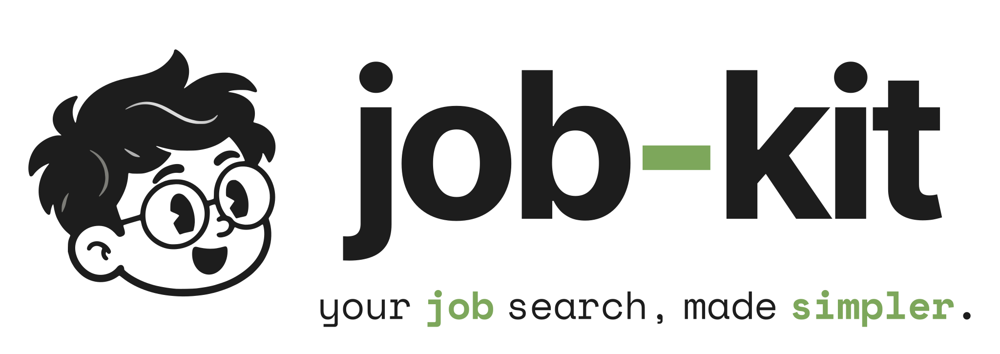

<h1 align="center">
  <picture>
    <source media="(prefers-color-scheme: dark)" srcset="app/public/brand/lockup-horizontal-dark.svg">
    
  </picture>
</h1>

Agent skills to find jobs, rank them against your profile, tailor your resume,
submit applications, and track replies in Gmail. Runs in Claude Code, Codex,
Grok, Hermes Agent, and [Aside Browser](https://aside.com).

Your profile and application records live in a directory you control, separate
from this repository. The [dashboard](https://r1cco.com/jobs/) opens the same
job records in your browser.

## Install

Open your coding agent or Aside at least once so its home directory exists.
Then run as your normal user:

```bash
curl -fsSL https://r1cco.com/install.sh | bash   # macOS / Linux / Git Bash
```

On Windows PowerShell:

```powershell
Invoke-RestMethod https://r1cco.com/install.ps1 -OutFile install.ps1
powershell -ExecutionPolicy Bypass -File install.ps1
```

The installer detects available targets. Windows and macOS support Aside,
coding agents, and browser-use; Linux supports coding agents and browser-use.
To select a channel or preview changes:

```bash
curl -fsSL https://r1cco.com/install.sh | bash -s -- agents
curl -fsSL https://r1cco.com/install.sh | bash -s -- all --dry-run
```

Channels are `all` (default), `agents`, `browser-use`, and `aside`.

Re-run the install command to update. The package lives at
`${XDG_DATA_HOME:-$HOME/.local/share}/job-kit` by default
(`%USERPROFILE%\.local\share\job-kit` on Windows). Keep this directory:
installed skills depend on it. Installation and updates leave your profile
untouched.

## Getting started

Run these skills in your agent:

1. `/job-profile` — create and activate a profile from your CV, register an
   existing one, or edit search preferences, packs, and CV settings. Profile
   setup requires a coding agent.
2. `/job-scout` — find openings from selected search packs or a site URL.
3. `/job-list` — review saved jobs and application statuses.
4. `/job-apply` — fill, submit, and record applications.
5. `/job-inbox` — check replies from a session with Gmail access.

**`/job-apply` submits without pausing for approval.** Use `/job-prep` to prepare
application packages without submitting. Scout finds and records jobs; inbox
reads mail and updates matching records.

Your profile defaults to `${XDG_CONFIG_HOME:-$HOME/.config}/job-kit`:
`data/` holds your facts, `cv/` holds base resumes, and `scout/` holds jobs and
application packages. Use `/job-profile` to activate another directory.
Aside needs filesystem access to that directory.

Resume tailoring requires a base CV PDF and its matching `.tex` source under
`cv/`. Use `/job-profile cvs` to select the base or disable per-vacancy tailoring.

`/job-match --typesafe` fills fit scores with TypeSafe's Jev model instead of
the LLM match worker; high or low-confidence rows are still re-checked by the
validate worker. Set `TYPESAFE_API_KEY` (from
https://console.typesafe.ai/settings/keys) first. It sends each job and your
full match profile to `api.typesafe.ai`: roles, skills, domains, languages,
work history, preferences, work authorization, and search constraints. Your
name and contact details are not included.

## Documentation

Each skill contains its usage and detailed workflow:

| Skill                                                 | Purpose                                                   |
| ----------------------------------------------------- | --------------------------------------------------------- |
| [job-profile](skill/job-profile/SKILL.md)             | Create, register, or edit a profile.                      |
| [job-scout](skill/job-scout/SKILL.md)                 | Find and rank live openings.                              |
| [job-list](skill/job-list/SKILL.md)                   | Read saved jobs and statuses.                             |
| [job-match](skill/job-match/SKILL.md)                 | Assess fit and get resume guidance.                       |
| [job-prep](skill/job-prep/SKILL.md)                   | Prepare applications without submitting.                  |
| [job-apply](skill/job-apply/SKILL.md)                 | Submit and record applications.                           |
| [job-resume-refine](skill/job-resume-refine/SKILL.md) | Tailor a one-page resume.                                 |
| [job-inbox](skill/job-inbox/SKILL.md)                 | Track Gmail replies.                                      |
| [job-stories](skill/job-stories/SKILL.md)             | Build interview stories, scripts, and experience bullets. |

Shared skills handle [profile lookup](skill/job-profile-root/SKILL.md) and
[job records](skill/job-store/SKILL.md).

## Uninstall

Remove installed skills while keeping Job Kit profile data and the cache.
These commands also remove the `browser-use` driver skill, CLI, and saved
state, even if you use them outside Job Kit:

```bash
curl -fsSL https://r1cco.com/install.sh | bash -s -- uninstall
```

On Windows, run the downloaded script with `uninstall`:

```powershell
powershell -ExecutionPolicy Bypass -File install.ps1 uninstall
```

For the interactive removal menu, run `scripts/uninstall.sh` or
`scripts\uninstall.ps1` from the installed package. It shows the removal plan first.
**Choosing `all` in that menu also deletes profile data and the cache**, and
requires typing `yes`.

## Development

```bash
git clone https://github.com/rafaeelricco/job-kit.git
cd job-kit
bash scripts/install.sh
npm test
```

On Windows, use `powershell -ExecutionPolicy Bypass -File scripts\install.ps1`.
Coding-agent installs link to the checkout, so edits take effect there.
Re-run the installer to refresh Aside copies.

To develop the dashboard, install Node.js and pnpm, then run from the repository root:

```bash
pnpm --dir app install
pnpm --dir app dev
```

Check dashboard changes with:

```bash
pnpm --dir app typecheck
pnpm --dir app lint
pnpm --dir app build
```
