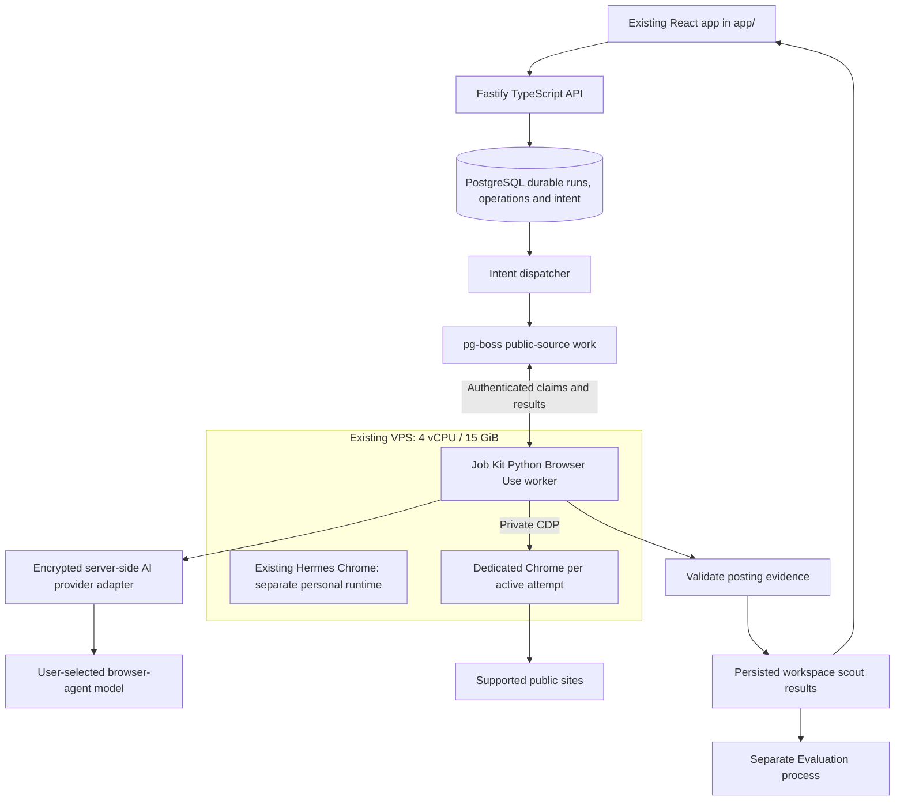

# Self-hosted discovery browser workers

Status: proposed · Updated: 2026-09-21 · Implementation: not implemented

[Decision](../decisions/0006-self-hosted-discovery-browser.md) · [Self-hosted platform](../decisions/0008-self-hosted-platform.md) · [First scout](../delivery/steps/04-first-scout.md) · [Execution](execution.md) · [Scaling research](../research/backend-browser-scaling.md)

## Selected scenario and existing host

Public browser searches run on the user's VPS using the open-source Browser Use Python library and self-hosted Chrome under Docker Compose. The web app starts durable work through the API and displays persisted results; user laptops are not required for public navigation. Scout and match remain independent.

The user reports an existing Ubuntu VPS with 4 vCPU and 15 GiB RAM, running Hermes v0.20.5 and Chrome 152.0.7977.64. This inventory was supplied on 2026-09-21, not remotely verified. Hermes uses a windowed Chrome through CDP on loopback port 9222, with a persistent `/root/.hermes/chrome-debug` profile. Xvfb display `:99`, openbox/tint2, x11vnc on loopback 5900, and noVNC on loopback 6080 provide SSH-tunneled operator access. Hermes clients all share that browser.

Existing systemd services restart that Chrome when it closes. Reported Chrome settings are `CPUWeight=300`, `Nice=-5`, and `MemoryLow=6G`; `/dev/shm` is 7.9 GiB. These values are not measurements of current usage or spare capacity. CPU weight is relative, MemoryLow is memory-reclaim protection rather than a hard allocation/cap, and shared-memory capacity is not extra RAM.

Do not reuse Hermes's browser/profile for platform work. It contains personal cookies, shared tabs, and independent controllers; Job Kit closing it could trigger its restart. Leave existing Hermes services and loopback ports unchanged. This design reuses the VPS, not that browser session. Host address and credential locations are operational inventory and need not be copied into product docs.

## Runtime boundaries

The Fastify API/domain/persistence and `pg-boss` dispatcher own durable work. The Python browser worker uses a versioned claim/result contract. Durable requests include operation and attempt IDs, source/search revisions, allowed capabilities, limits, and a deadline. Workers claim renewable leases and return validated results; the dispatcher does not connect to Chrome directly. Application-owned intent and operation receipts prevent queue redelivery from creating duplicate logical work.

Use `browser-use`, the open-source Python library, not the hosted `browser-use-sdk`. It supports local browsers and a selected model; CDP permits a separately launched Chrome. Browser hosting and inference are independent. Credentials are decrypted through the server-side provider adapter and are not copied into queue messages or Chrome profiles. [Official repository](https://github.com/browser-use/browser-use), [CDP support](https://docs.browser-use.com/open-source/customize/browser/remote).

Prefer a dedicated unprivileged Job Kit service account and isolated worker/container boundary. Let the worker launch an owned headless Chrome with a fresh profile per attempt. If launch and agent are separate, allocate a private loopback CDP port distinct from Hermes's 9222; select the exact free port at deployment. Across containers, use an unexposed private network instead. Never publish CDP through nginx or give the browser endpoint to web clients.

V1 public searches do not need Xvfb/noVNC. If operator-visible debugging is needed, provision a separate Job Kit display/browser and SSH-only viewer; do not route it through the personal Hermes desktop. Each attempt exclusively owns its browser process, profile, tabs, and artifacts.

## Search lifecycle

1. Starting scout pins revisions and returns a durable run ID. Collection receives source inputs, not a full private CV or candidate history.
2. Resolve supported sources. Retain direct HTTP reads for documented ATS routes; use Browser Use for declared browser routes. A route failure does not silently change transports.
3. Claim a bounded operation and available browser slot. Launch the dedicated Chrome with an empty temporary profile.
4. Browser Use navigates allowed public pages, submits source searches where applicable, paginates, expands descriptions, and returns structured evidence.
5. Validate URLs, provenance, fields, completeness, and canonicalization outside the model. Persist completed observations/checkpoints incrementally through scoped commands. Agent-reported success alone is insufficient.
6. Close only the owned Chrome, clean temporary data, and record complete/partial/empty/blocked/failed coverage. The API creates matching work independently from persisted postings.

The existing scout skill provides rules, not a drop-in backend implementation. Replace its local profile paths, host tools, and dossier writes with explicit input snapshots and validated commands. Preserve query evidence, eligibility checks, and distinct scout/match scores while applying step 04's persistence-before-match design.

Pin Chrome and Browser Use versions. Browser Use documents headless execution, executable paths, temporary profiles, domain controls, agent limits, and structured results. Verify these against the deployed versions rather than assuming all current defaults are suitable. [Browser settings](https://docs.browser-use.com/open-source/customize/browser/all-parameters), [agent controls](https://docs.browser-use.com/open-source/customize/agent/all-parameters), [output](https://docs.browser-use.com/open-source/customize/agent/output-format).

## Capacity and operations

Start the coexistence proof with **one concurrent Job Kit browser**, then test two only if measurements show headroom. This is an initial test limit, not a capacity guarantee. Measure under normal Hermes activity, including its CPU priority and memory protection. Set explicit Job Kit CPU/memory/process/disk limits after the baseline; do not assume the remaining 9 GiB is available or reduce Hermes's protection without a separate operational decision.

Hundreds of registered users can queue behind a small pool; the pool's throughput and queue latency determine the experience. Record startup time, held browser minutes, agent steps/tokens, CPU, peak memory, failed extractions, and queue age. If one slot takes two minutes per operation, its ideal upper bound is 30 operations/hour before retries and other limits, not 30 complete user scouts. A scout can need multiple operations.

Fresh public source snapshots and request coalescing can reduce repeated work, while workspace posting IDs and private matches remain separate. Shared caching is still a proposed refinement to [posting identity](../decisions/0004-posting-identity.md), not an implemented capability. Cache complete public reads with content-affecting query/locale parameters; never reuse personalized or incomplete data as a complete public board.

When queue latency exceeds the chosen target, add workers on another VPS using the same claim contract. Source limits, deduplication, and leases must span machines. Moving Job Kit to its own VPS may be preferable to contention with Hermes. More machines add capacity but do not automatically make the control plane/database highly available.

The worker supervisor restarts the worker, not every disposed attempt browser. Recover unfinished work through leases and checkpoints; do not resurrect every closed Chrome with `Restart=always`. Add independent cleanup for orphaned processes/profiles after crashes. Keep authoritative data outside disposable browser containers, with backups and retention for diagnostic artifacts.

## Boundaries and costs

Run Chrome unprivileged and verify sandboxing on the actual host/container. Browser Use's documented sandbox default differs in Docker; do not assume it is enabled. Apply network-level restrictions against private, loopback, link-local and metadata destinations, including redirects/subresources. Agent navigation allowlists alone do not prevent access through every browser request. Browser processes receive neither database administrator credentials nor Hermes files.

Constrain tools to supported list-only source actions. Generic clicks are not inherently read-only. A login wall/challenge is blocked or unsupported in public-only V1; it does not authorize use of personal cookies, applying, or messaging. The VPS IP may be rejected by a source. Local Chrome does not automatically include managed stealth/proxy/challenge services.

Budget for VPS compute, model inference, traffic or optional proxies, storage, and maintenance. There is no managed-browser hourly charge for this selected path. Browser hosting does not supply inference: the worker calls the user's selected AI provider through the encrypted server adapter, and the supported authorization path and billing terms must be validated for each method. Bound steps, time, retries, pages, and spend. No silent hosted-browser fallback.

## Implementation gates

Confirm actual host utilization and deployment permissions; select the browser-agent model/budget; name the first public browser source; define the lease/result contract and queue-latency target. Test evidence accuracy, isolation from Hermes and other attempts, process cleanup, source throttling, worker restarts, cancellation, and workspace result isolation. No deployment, server inspection, or credential access was performed for this documentation update.
