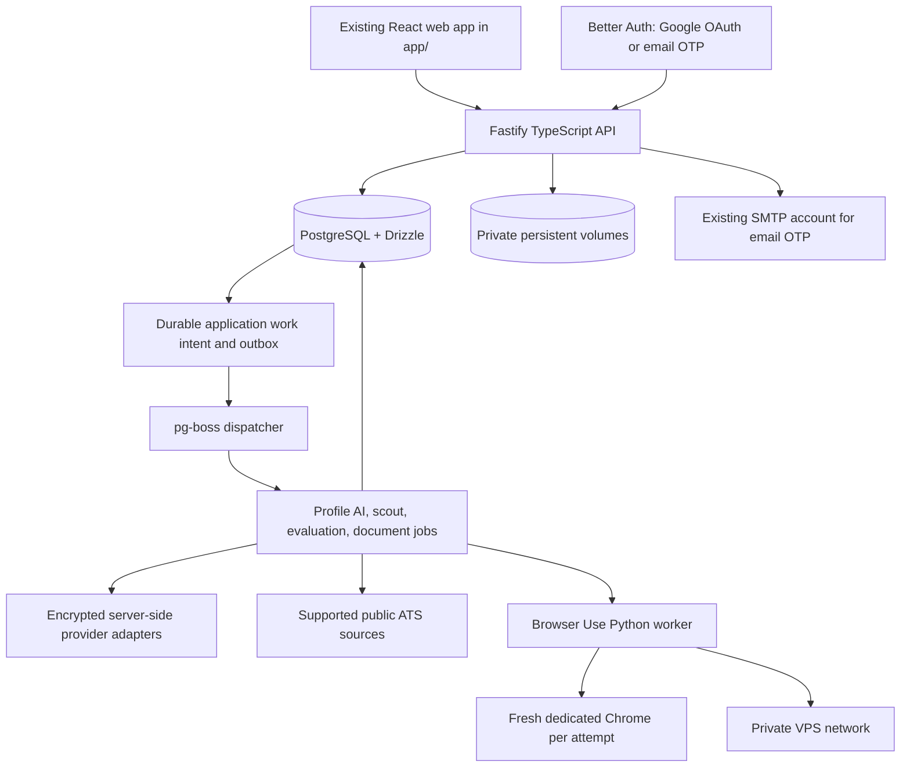

# Platform architecture

Status: proposed · Updated: 2026-09-21 · Implementation: not implemented

Job Kit is a web-only product. It retains the existing React application in `app/` and adds a TypeScript API and workers on the owner's VPS with Docker Compose. PostgreSQL is authoritative for business state and durable work intent; `pg-boss` dispatches work from that durable intent. Private persistent volumes hold controlled files outside the nginx static root and are reached only through authorized server APIs. Provider adapters encrypt credentials and tokens before persistence. See [Decision 0007](../decisions/0007-web-only-platform.md) and [Decision 0008](../decisions/0008-self-hosted-platform.md).

This is the selected design, not an implemented platform or a completed provider-compatibility proof. Read the [domain guide](../domain/README.md) for ownership and business rules. The [decision index](../decisions/README.md) distinguishes accepted directions from superseded proposals.

## System boundaries

All product services and durable state run on the owner's VPS. Remote model providers and public job sites are explicit external integrations; no managed auth, database, workflow, browser, or object-storage service is selected. Authentication establishes one private workspace per user. The auth library owns secure identity linking, so Google and email sign-in do not create duplicate candidate accounts through application-level email comparisons.

The API is the authorization and domain boundary. It validates commands, resolves workspace ownership from authenticated context, and returns durable operation IDs. Workers receive bounded, versioned inputs and scoped credentials through server-side adapters; they do not receive database administrator access. Workers persist observations and progress through authorized server contracts. Public discovery uses fresh, isolated browser profiles and never requires a user's computer or logged-in browser.

## Selected stack

| Layer            | Selected direction                                                            | Boundary                                                                                                                     |
| ---------------- | ----------------------------------------------------------------------------- | ---------------------------------------------------------------------------------------------------------------------------- |
| Web              | Existing React/Vite app in `app/`; retain routes, settings, and design system | Replace local data access through adapters as journeys migrate; preserve import/export compatibility                         |
| API              | Fastify, TypeScript, Zod contracts                                            | Authenticated commands and queries own validation, authorization, and domain transitions                                     |
| Data             | PostgreSQL with Drizzle                                                       | Business records, selective domain events, operation receipts, and durable dispatch intent share transactions                |
| Identity         | Better Auth with Google OAuth or passwordless email OTP                       | Pilot access is limited to the approved email list; existing SMTP sends OTP mail                                             |
| Work             | `pg-boss` on PostgreSQL                                                       | Durable delivery is backed by application intent and receipts that outlive queue retention                                   |
| Files            | Private persistent VPS volumes and encrypted server-side provider adapters    | Files stay outside the nginx static root and are accessed through authorized API handlers                                    |
| Public discovery | Python Browser Use worker and dedicated Chrome on the VPS                     | HTTP ATS adapters and public-only browser routes have explicit source support and bounded capacity                           |
| AI               | User-configured OpenAI, Gemini, Anthropic, or xAI adapters                    | Credentials are encrypted server-side; authorization and hosted compatibility remain validation gates                        |
| Evaluation       | TypeScript matching, with the existing Python deterministic scorer retained   | TypeSafe is platform-funded; if unavailable, use the selected user AI. Never switch accounts or billing routes automatically |
| Documents        | Existing Python scoring/validation helpers and isolated PDF tooling           | CV intake is text-based PDF with manual fallback; no OCR scope                                                               |

The target is a modular monolith plus the isolated Python browser worker. It does not add Kafka, Kubernetes, a companion, extension, managed workflow engine, managed browser service, or managed storage. Current AI and public-site integrations remain explicit remote calls with separate authorization and data boundaries.

## Design map

- [Persistence](persistence.md): domain event boundaries, receipts, transactional intent, `pg-boss` delivery, projections, and replay.
- [Execution](execution.md): durable profile, discovery, evaluation, and document work and recovery.
- [Browser workers](browser-workers.md): VPS-hosted Browser Use and Chrome, Hermes isolation, resource limits, and scaling.
- [Identity and data](identity-and-data.md): workspace isolation, credential encryption, controlled content, and deletion.
- [Repository](repository.md): retained `app/` layout, server entrypoints, package dependencies, and skill migration.
- [Roadmap](../delivery/roadmap.md): proofs, delivery milestones, and launch gates.

API handlers and workers share domain contracts. Domain code does not depend on Fastify, `pg-boss`, auth vendors, browser libraries, or model SDKs. External calls run outside database transactions; their results return through validated commands. Historical vendor and companion proposals remain in dated research and superseded ADRs, not as selected mechanisms.
