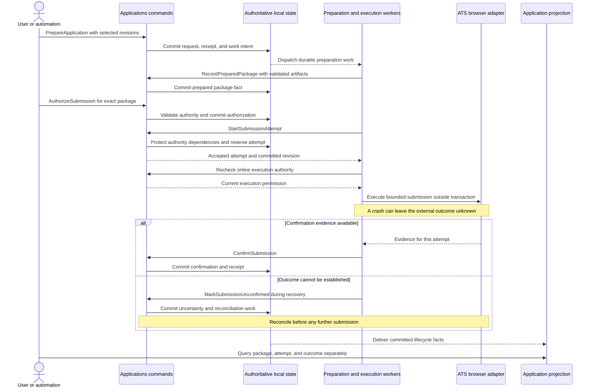

# Application submission journey

Status: proposed · Updated: 2026-09-21 · Implementation: not implemented

This walkthrough illustrates coordination between modules. [Applications](../applications.md#decision-boundary-and-retained-evidence) owns the package, authorization, cancellation, and attempt invariants. [Workspace](../workspace.md) owns current authority. [Persistence](../../architecture/persistence.md) and [execution](../../architecture/execution.md) own shared mechanisms. Commands and events are illustrative.

**Proposed post-V1 example.** Application preparation and submission are outside V1. This journey selects no future mechanism and assumes no companion or local executor.

## Worked process: prepare, authorize, submit, reconcile

The actor wants one application submitted with known answers and artifacts. The selected mode is exact-package authorization. An explicit user action or an existing automation policy can authorize that package. This example does not introduce a mandatory human approval for every submission.

| Actor and command                                 | Authoritative inputs and invariant                                                                                             | Accepted fact and retained evidence                                                                              |
| ------------------------------------------------- | ------------------------------------------------------------------------------------------------------------------------------ | ---------------------------------------------------------------------------------------------------------------- |
| User or automation: `SaveOpportunity`             | Authorized workspace and identified posting; resolve duplicate requests against the same operation                             | `OpportunitySaved`, linking the pursuit to its posting                                                           |
| User or automation: `PrepareApplication`          | Selected immutable profile, posting, answer, and relevant evaluation revisions                                                 | `ApplicationPreparationRequested`, retaining input identities and preparation identity                           |
| Preparation worker: `RecordPreparedPackage`       | Result belongs to the requested inputs; required answers and validated artifacts are present                                   | `ApplicationPackagePrepared`, binding a package revision to input references and artifact digests                |
| User or policy executor: `AuthorizeSubmission`    | Prepared package is eligible under current authority; a fit score alone cannot authorize it                                    | `SubmissionAuthorized`, retaining exact package identity, actor or applicable policy revision, and decision time |
| Execution coordinator: `StartSubmissionAttempt`   | Package and authorization match; current authority and cancellation permit execution; no competing active or uncertain attempt | `SubmissionStarted`, identifying the claimed attempt and authorized package                                      |
| Browser worker or reconciler: `ConfirmSubmission` | Evidence identifies the relevant attempt, account, and posting and meets the selected adapter's confirmation rules             | `SubmissionConfirmed`, retaining evidence references and the external reference when available                   |
| Coordinator: `MarkSubmissionUnconfirmed`          | Execution may have happened and its outcome cannot be established                                                              | `SubmissionUnconfirmed`, retaining the attempt and reason for uncertainty                                        |
| Reconciler: `ReconcileSubmission`                 | Inspect available evidence for the same attempt; absence of a response is not proof of failure                                 | An evidence-supported resolution, or continued uncertainty with inspectable observations and required action     |

`SubmissionStarted` records that execution of the attempt was accepted. It does not assert that the website received the submission. Reconciliation is a process, not proof of success, and does not by itself permit another click. ATS-specific confirmation rules and any path to a new attempt after a proven non-submission remain explicit design decisions.

Preparation reactions obtain inputs, generate documents, and return validated results through `RecordPreparedPackage`. Missing answers go through Candidate's proposal/confirmation flow. New answers change the input revision and require a new preparation decision. They do not silently mutate a frozen request. A stale worker result remains bound to its original request.

After authorization, the execution coordinator checks current authority and claims the attempt. The browser adapter performs the bounded action outside the transaction. It returns confirmation evidence or leaves recovery to the uncertainty/reconciliation path. Later communications request outcome decisions from Applications. Neither message classification nor posting closure directly overwrites the application outcome.

The uncertainty branch can be performed by a recovering coordinator after worker death. It does not depend on the failed worker reporting its own failure. A recovery claim or expired lease is not evidence that the remote click failed.

## Scenarios and remaining decisions

These are proposed acceptance scenarios, not executed tests.

| Given                                                | When                                                          | Then                                                                                                                          |
| ---------------------------------------------------- | ------------------------------------------------------------- | ----------------------------------------------------------------------------------------------------------------------------- |
| A package with missing required answers              | Preparation returns an incomplete result                      | Readiness is not accepted; unresolved answers stay visible without invented facts                                             |
| An accepted command whose response was lost          | The same command and input are retried                        | The receipt returns the original result without a second accepted operation                                                   |
| A used command identity                              | It is retried with different semantic input                   | The request is rejected without altering its accepted history                                                                 |
| Two workers read the same eligible application       | Both try to start submission                                  | One valid attempt commits; the other reloads or returns the existing result/conflict                                          |
| Authorization for package A                          | Answers or artifacts produce package B                        | B needs a new authorization decision, which an applicable automation policy can supply                                        |
| Revoked authority or accepted cancellation           | A subsequent start is decided                                 | Execution is rejected; a transaction cannot partially record an accepted start                                                |
| A worker with execution permission disappears        | No reliable evidence proves whether it clicked                | The attempt remains or becomes uncertain and recovery does not blindly submit again                                           |
| An uncertain attempt                                 | Another worker acquires a recovery lease                      | It reconciles the same operation rather than treating the lease as permission for a new submission                            |
| Cancellation and an already-issued submission        | Valid confirmation arrives later                              | Confirmation remains historical evidence; cancellation does not erase it                                                      |
| A message with ambiguous application correlation     | Communications proposes an outcome                            | Applications does not overwrite its outcome without admissible evidence                                                       |
| Historical authorization referencing deleted content | The projection is rebuilt or a new command needs that content | Lifecycle facts remain explainable, missing content stays unavailable, and a new evidence-dependent decision cannot invent it |
| Recorded decisions under an earlier policy and clock | The same history is replayed later                            | Decision state is reconstructed deterministically without new external work                                                   |

The selected defaults are workspace-scoped posting identity first, exact-package authorization in the worked example, and preservation of existing authorized automation. The custom event-delivery engine remains an undecided infrastructure adapter. The current outbox/scheduler recommendation stands.

These decisions should stay explicit in their owning modules: bounded live edits, ATS-specific confirmation evidence and reconciliation UX, and reapplication after a prior attempt. They also include profile-publication granularity, continued use after evidence deletion, and observation precedence. Finally, they include consequential classification corrections and retention policy. These questions limit implementation readiness. Documenting a scenario does not settle them.

The design should import legacy dossiers as known state with provenance and known source dates. The corpus is not complete event history. It should not fabricate past preparation, authorization, or submission events merely to make an imported timeline appear complete. Historical schema compatibility and unavailable-content behavior need fixtures when the event-sourced implementation is built.
