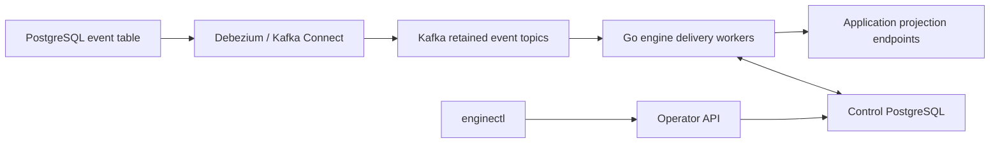

# Event Delivery Engine: external specification snapshot

Snapshot retained: 2026-09-20. Source revision: `fad2bdd`. Job Kit adoption: undecided. This copy is supporting reference material, not Job Kit's selected infrastructure. The original source location is recorded below; it requires access to a separate checkout.

Implementation status at `fad2bdd`: capture provisioning, live delivery, pause/resume, and the status/logs operator API are built. Replay, metrics, `enginectl` status/subscription/replay commands, configuration-revision and audit storage, and migration tooling are specified only.

Job Kit adoption remains undecided. This specification describes event delivery, not the application's domain authority or workflow scheduler. See the [documentation index](../README.md) and [domain model](../domain/README.md).

## Purpose and boundaries

Event Delivery Engine is a reusable Go service for personal projects. It
captures committed append-only PostgreSQL events through Debezium and Kafka,
retains them in Kafka, and sends Ambar-compatible HTTP events to application
projections. Each project deploys its own namespace, topics, Connect connector,
consumer groups, and control state.

The engine owns capture provisioning, delivery, retrying, offsets, replay jobs,
and operational visibility. Applications own event schemas, event-store writes,
projections, business rules, and external side effects.

V1 supports PostgreSQL and `http-push` only. It excludes MySQL, SQL Server,
files, an event-store replacement, public publishing, shared-platform tenancy,
a GUI, automatic reaction replay, and exactly-once HTTP effects.

## Architecture and state



Kafka stores captured records and delivery offsets. Kafka Connect stores source
offsets, connector settings, and status. Control PostgreSQL stores approved
configuration revisions, stream identities, subscription state, operator audit
entries, replay definitions and boundaries, and terminal `keep_going` skips.
Kafka remains authoritative for delivery progress.

Production uses Kafka replication factor 3, `min.insync.replicas=2`, and all
in-sync producer acknowledgements. Local development has one broker and one
Connect worker, but keeps the same Kafka/Debezium pipeline. Event topics use
delete-only, infinite retention; compaction is forbidden because events sharing
a key must remain replayable.

## Source and topic contract

One source is one PostgreSQL table. It requires a unique non-null integer serial
column, non-null partitioning column, immutable event identity (`event_id` when
present), and every column needed by the payload. Debezium must configure the
Kafka key from `partitioningColumn`, never silently from the table primary key.
HartAgency uses `correlation_id`.

An initial ascending snapshot is followed by WAL streaming. Snapshot reads and
inserts are accepted. Updates, deletes, truncations, unsupported schema changes,
lost WAL, and lost replication slots block the source visibly; they are never
skipped or resnapshotted into an established generation.

A stream generation freezes table, key serialization, partition count, event
identity mapping, and payload profile. Changing any of them requires a new
generation, connector, slot, publication, and topic. A recreated topic or a
lost history boundary blocks affected delivery.

## YAML and HTTP compatibility

The engine accepts legacy `data_sources` and `data_destinations`. PostgreSQL
sources use `host`, `port`, `username`, `password`, `database`, `table`,
`columns`, `serialColumn`, and `partitioningColumn`. HTTP destinations use
`endpoint`, `username`, `password`, `sources`, and optional `filter`.

Validation rejects duplicate IDs, unknown source references, unsupported types,
empty filters, incomplete source settings, and payload columns that omit serial
or partitioning fields. `${NAME}` environment substitution is supported inside
YAML strings; missing values fail validation. Secrets are redacted in logs and
stored metadata.

Every delivery is a Basic-authenticated JSON `POST` with this unchanged envelope:

```json
{
  "data_source_id": "application_events",
  "data_source_description": "Application event store",
  "data_destination_id": "Accounts_Projection",
  "data_destination_description": "Accounts read model",
  "payload": { "event_id": "evt_42", "payload": "{\"type\":\"AccountCreated\"}" }
}
```

The engine adds stable diagnostic headers for event ID, delivery generation,
replay, Kafka topic/partition/offset, and idempotency key. The Debezium envelope
does not reach application handlers.

`{"result":{"success":{}}}` acknowledges. `must_retry` retains the record.
`keep_going` audits a terminal skip then advances. Empty, malformed, unknown,
non-2xx, timeout, and connection-error responses retry. Redirects are not
followed. Responses larger than 64 KiB retry; exactly 64 KiB is accepted.
The default total request timeout is 60 seconds.

Filters preserve emulator behavior: matching string values deliver;
nonmatching strings skip; missing/non-string values and non-object payloads pass
through. Serialization preserves integer precision, booleans, nulls, text,
JSON-as-text, and timestamp strings. Exact binary edge cases require fixture
certification before a compatibility release.

## Delivery, recovery, and replay

Each destination/generation is a Kafka consumer group. One HTTP request is active
per assigned partition; other partitions and destinations can continue. Automatic
commits are disabled. After a terminal outcome, the worker commits the next
offset before dispatching the following record.

Failures retry forever with jittered exponential backoff from one second up to
60 seconds, blocking only their partition. There is no automatic dead-letter
skip. On revocation, workers stop scheduling, cancel in-flight requests, commit
only contiguous completed work while ownership is valid, and discard late
results. On lost ownership they never commit. A 30-second control lease,
renewed every five seconds, stops new dispatch when control state is unreachable.

The guarantee is at least once. A receiver may commit before the engine commits
its Kafka offset and then see a duplicate. Projections must atomically apply the
change and record event/destination deduplication. Reactions require their own
provider or receiver idempotency; Kafka cannot make arbitrary HTTP effects
exactly once.

Only destinations classified as projections with configured replay targets may
replay. A replay has an independent consumer group and cannot alter normal
offsets. Creation validates stream identity and history, captures start offsets
and exclusive per-partition boundaries, stores the configuration revision and a
fresh-state declaration, then starts dispatch.

A bounded replay stops at its boundary. A follow replay continues after reaching
that initial boundary. States are `created`, `running`, `following`, `paused`,
`blocked`, `completed`, and `cancelled`. Restart resumes from Kafka commits;
missing history blocks; a cancelled job cannot resume.

Kafka groups alone cannot rebuild an application with event-ID deduplication.
Replay targets must use a fresh projection/deduplication database or a separate
application generation namespace. Application code validates the rebuilt model
and switches read traffic; the engine does not promise atomic multi-partition
cutover during ongoing writes.

## Operations, testing, and migration

The operator API is private and uses a distinct bearer token. It exposes health,
status, source and subscription state, pause/resume, and replay lifecycle.
`enginectl` validates configuration, provisions/activates infrastructure, reports
status, controls subscriptions, and manages replay. Mutations are idempotent and
must wait for worker observation before reporting completed state.

Metrics cover connector and replication-slot health, capture/delivery lag,
attempts, retries, skips, HTTP latency, blocked partitions, rebalances, replay
progress, worker lease status, and Kafka/control-database availability. Logs use
source/destination/generation/topic/partition/offset identifiers and omit
credentials and full business payloads.

Release testing uses real PostgreSQL, Kafka, Connect, and HTTP receivers for
snapshot/live capture, delayed commits, routing, retries, restarts, rebalance,
broker and control-store failures, replay isolation/restart, missing history,
contract violations, and persistent local volumes. Compatibility fixtures cover
legacy YAML, Basic auth, envelope fields, acknowledgements, filters, types, and
partition keys.

Migration shadows the emulator into a recording receiver, compares sanitized
event identities and payloads, and rebuilds fresh projection state. It then
establishes a cutover boundary, stops emulator delivery, and enables the
engine. Emulator offsets cannot be converted to Kafka offsets. The team should
never shadow real reaction endpoints with both systems.

The implementation copy is maintained at
`/Users/rafaelricco/Projects/ambar/event-delivery-engine/docs/specification.md`.
