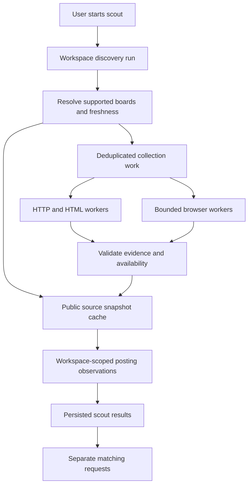

# Scaling backend navigation for public job discovery

> **Historical research, not current implementation guidance (updated 2026-09-21).** Preserve the dated evidence and validation limits below. Recommendations for companions, local executors, managed workflow/browser services, Supabase, or platform-selected AI routes are superseded. Current decisions are web-only, self-hosted on the owner's VPS, and user-funded AI connections for OpenAI, Gemini, Anthropic, and xAI; hosted compatibility and authorization remain unproven gates. TypeSafe matching remains platform-funded. If user AI is unavailable, work waits for reconnect or an explicit manual account switch. See the current [decision index](../decisions/README.md) and [platform architecture](../architecture/overview.md).

[Research index](README.md) · [First scout](../delivery/steps/04-first-scout.md) · [Earlier browser study](browser-scout.md)

Research checked on 2026-09-21. User-confirmed scope: public job sites only for V1, with hundreds of platform users. This is an architecture recommendation and capacity model, not an implemented system, vendor selection, or live benchmark. Prices are USD, before tax; vendor limits and prices need confirmation when purchasing.

## Current disposition

The user subsequently selected self-hosted Chrome on their existing VPS with the open-source Browser Use library. [Decision 0006](../decisions/0006-self-hosted-discovery-browser.md) records that accepted choice; [browser workers](../architecture/browser-workers.md) incorporates the supplied 4-vCPU/15-GiB host and its separate personal Hermes browser. The managed-first recommendation below is retained as the earlier comparison, not the current selection. Shared caching remains proposed.

## Earlier recommendation

Build a shared public-source collection service with three explicit transports: documented HTTP APIs, HTML fetch/parsing, and short-lived browser sessions for JavaScript/navigation. Keep candidate-specific matching separate. Browser demand should follow the number of distinct sources and their freshness requirements, rather than the number of users pressing Search.

For a small team, benchmark managed browser infrastructure first: Browserbase for the general navigation baseline and Cloudflare Browser Run for public rendering. Add Browser Use infrastructure as the price/compatibility challenger if network usage makes it attractive. Own the deterministic source adapters and the durable queue. Do not start by running an unconstrained AI agent for every user's search.

Self-hosted Playwright with Crawlee is a credible alternative when the team can operate Chromium securely and measurements show an advantage. Neither hundreds of users nor a need for browser navigation implies Kubernetes, a desktop app, or one permanently running browser per user.

This refines the previous local-browser emphasis for the confirmed V1 scope. The companion can remain relevant to subscription-funded matching, but public collection should not wait for a user's laptop. It also proposes bringing shared public caching forward: [posting identity](../decisions/0004-posting-identity.md) currently defers it. A shared transport cache can coexist with workspace-scoped posting identities and observations; it does not require merging domain aggregates across users. No decision record is changed by this study.

## What the backend actually runs

A headless Chromium process loads pages and executes JavaScript. Playwright or another controller navigates, clicks pagination, expands descriptions, and extracts evidence. The user sees progress and persisted postings in Job Kit, not a streamed browser desktop. Screenshots and traces are primarily debugging artifacts in this V1.

Use source adapters with declared transports. A public ATS route is read through HTTP; a static career page through HTML parsing; a supported JavaScript-only listing through a browser. A known route failure remains a failure unless an explicit, tested fallback policy permits another transport. Unsupported sites and login walls remain visible outcomes.

Browser hosting and navigation intelligence are independent choices. A managed browser can run ordinary deterministic Playwright code without an LLM. If a source requires model-assisted interpretation, constrain that step and measure it separately. Extract reusable posting facts once per changed content revision; perform candidate-specific matching against those facts later.

## Options worth comparing

These rankings are engineering judgments for public-only V1. Documented product capabilities do not establish success on the target sites.

| Option                                      | What it supplies                                           | What Job Kit still owns                                                 | Best fit / main tradeoff                                                              |
| ------------------------------------------- | ---------------------------------------------------------- | ----------------------------------------------------------------------- | ------------------------------------------------------------------------------------- |
| Managed browser + owned Playwright adapters | Remote sessions, browser lifecycle, provider observability | Source navigation, queue, validation, domain state, budgets             | Recommended first proof; less infrastructure work, usage fees and provider dependence |
| Cloudflare Browser Run                      | Managed rendering and browser-control interfaces           | Adapters, queue, evidence and result storage                            | Strong public-page candidate; test runtime and site compatibility                     |
| Self-hosted Playwright + Crawlee            | Browser automation and crawl primitives                    | Compute, isolation, scaling, updates, egress, traces, incident response | Greater control; operations cost can exceed browser rental savings                    |
| Managed extraction/crawl endpoint           | URL-to-content or crawl result                             | Source scope, correctness checks, freshness and identity                | Good for simple public pages; less control over multi-step navigation                 |
| Hosted autonomous browser agent             | Browser plus model-driven navigation                       | Task constraints, evidence validation, retry semantics, spend controls  | Useful exception path; variable duration and model/network cost                       |

### Managed browser infrastructure

Browserbase supports reusable remote sessions and exposes capacity limits with throttling responses. Its Startup price lists 100 concurrent browsers, 500 included hours, and $0.10 per additional hour at $99/month. Session creation limits must be handled separately from active-session capacity; inspect returned limits and `Retry-After`. [Pricing](https://www.browserbase.com/pricing), [concurrency](https://docs.browserbase.com/optimizations/concurrency/overview).

Browser Use offers browser infrastructure independently of its hosted agent. Its price separates browser time, network traffic, and agent/model usage. The cheap hourly number must be evaluated alongside downloaded bytes; default proxy configuration matters. Verify the actual project's concurrency allowance before designing a burst SLO. [Quickstart](https://docs.browser-use.com/cloud/quickstart), [pricing](https://browser-use.com/pricing), [documentation index and operational notes](https://docs.browser-use.com/llms.txt).

Browserless is a further Playwright-compatible provider and offers commercial self-hosting. Its displayed annual-billing plans include 40 and 100 concurrent browsers, with unit allowances and session-duration limits. Metering includes time, reconnects, and proxy traffic. Obtain a monthly quote rather than treating annual rates as monthly commitments. [Plans](https://www.browserless.io/pricing), [unit consumption](https://docs.browserless.io/overview/unit-consumption).

Choose one provider for the first production path. Keep session creation/closure behind an adapter, but do not pretend profile formats, traces, launch options, or billing are portable. Public stateless reads are easier to move between providers than authenticated sessions.

### Cloudflare for public rendering

Cloudflare Browser Run offers browser sessions through Playwright, Puppeteer, and CDP, and quick-action endpoints. Paid defaults currently allow 200 concurrent sessions and three new browsers per second. The default 60-second timeout is inactivity, not total runtime; keep-alive can extend it to ten minutes, and releases can still terminate sessions. [Limits](https://developers.cloudflare.com/browser-run/limits/).

Its browser-session pricing includes both browser hours and concurrency. The latter uses the monthly average of daily peaks, not average occupancy. A short burst every day can affect that charge. Use this provider in the public-page benchmark; do not infer that nominal concurrency implies target-site compatibility. [Pricing](https://developers.cloudflare.com/browser-run/pricing/).

### Self-hosted workers

Run a small, capped pool of container workers outside the API process. A worker launches Chromium, claims a bounded source slice, persists observations/checkpoints, and releases its browser. Use a managed container service or a few worker machines first; scale on queue age and measured CPU/memory pressure.

Crawlee supplies URL queues, browser pooling, retries, and resource-aware concurrency. Its per-process controls do not replace a distributed source limiter across several workers. Integrate crawler progress with the platform's durable operations; avoid two independent retry systems multiplying attempts. [PlaywrightCrawler](https://crawlee.dev/js/api/playwright-crawler/class/PlaywrightCrawler), [scaling controls](https://crawlee.dev/js/docs/guides/scaling-crawlers).

Harden the runtime rather than deploying an unrestricted test container. Playwright explicitly warns that its default image is intended for testing/development; running as root disables Chromium sandboxing, and crawling guidance calls for a separate user and seccomp configuration. Browser contexts separate session state but are not a sufficient operating-system security boundary for hostile pages. [Playwright Docker guidance](https://playwright.dev/docs/docker).

Measure memory and CPU on the actual pages; no universal RAM-per-browser estimate is reliable. A container-per-task gives a stronger failure boundary and cleanup at greater startup cost. A warm worker pool reduces launches but needs recycling and a limit on simultaneous pages. For public sources, reuse a browser process only within the chosen isolation policy; use fresh contexts and do not import user cookies.

## Collection architecture



The cache holds independently collected, publicly listed source content. Profiles, exclusions, searches, scores, opportunity state, and workspace observation records stay private. Publicly accessible does not mean every item is suitable for shared recommendations: exclude unlisted/direct-link-only postings, tokenized URLs, and any source that needs credentials. Apply source access rules before collection.

A cache key needs source identity, region/locale and other content-affecting parameters, plus adapter version. Keep capture time and content hash. Use a collection generation or freshness window to deduplicate outstanding reads; do not deduplicate forever. Different queries may share a complete public board snapshot, but not falsely share query-specific or incomplete results.

If 200 users request the same stale board, create one collection operation and attach their runs to its outcome. On completion, each run receives its own observation and filtering. Canceling one user run must not cancel collection needed by other subscribers. A partial collection must never masquerade as complete or close absent postings.

Start without a timer-driven crawler if recurring discovery remains outside V1: coalesce user-triggered reads and reuse fresh snapshots. Scheduled refresh is a separate later product decision, not a requirement to obtain cache reuse.

## Capacity: model source work, then user demand

The following numbers are assumptions for planning, not benchmarks or recommended source polling rates. An operation means one bounded browser session, potentially reading several pages.

| Illustrative workload                                      | Browser operations/day | Mean session duration | Browser-hours/month (30 days) |
| ---------------------------------------------------------- | ---------------------: | --------------------: | ----------------------------: |
| Independent searches: 500 users, twice daily               |                  1,000 |             8 minutes |                         4,000 |
| Shared collection: 300 distinct JS boards, two reads daily |                    600 |             2 minutes |                           600 |
| Same 300-board set, only 20% requiring browsers            |                    120 |             2 minutes |                           120 |

The 300 boards, twice-daily reads, browser fraction, and times are arbitrary examples. HTTP work and posting-detail reads are excluded unless contained in each operation. Disjoint source selections or complex listings can erase the assumed savings. Measure unique sources, pages per board, change rate, cache hit rate, and fresh-coverage requirements before budgeting.

```text
monthly browser hours = operations/day × mean held minutes × days / 60
mean occupancy = operations in window × mean held minutes / window minutes
planning slots = ceil(mean occupancy / target utilization)
```

For 120 two-minute browser operations distributed over eight hours, occupancy is 0.5. At an illustrative 70% utilization, the arithmetic suggests one slot; several slots may still be needed for bursts, slow pages, and failure isolation. This is not a latency guarantee.

For the uncached example, 1,000 eight-minute sessions over 16 hours average 8.33 active browsers. At 70%, that suggests 12 slots before burst allowance. If 200 equal eight-minute jobs arrive together, 25 slots take eight waves, or 64 minutes to finish. Completing all within 30 minutes requires at least 67 slots for three eight-minute waves, ignoring launch overhead and source limits. Workload variability requires simulation using measured distributions.

Concurrency and throughput are different limits: active sessions, browser starts per second, navigation requests per host, bytes per second, and model tokens per minute can each bind. An ATS-domain-wide throttle can dominate even when browser capacity is free.

## Cost model

```text
total cost = plan/compute + browser time + network/proxies + model calls
           + queue/database/storage + evidence retention + operations/support
```

At the published Browserbase Startup browser rate, 600 hours imply $109/month and 4,000 hours imply $449/month for the plan and browser time alone. At 120 hours, the $20 Developer plan plus 20 excess hours implies $22.40. These omit all additional usage and infrastructure. [Browserbase pricing](https://www.browserbase.com/pricing).

Browser Use lists $0.02/hour plus $0.20/GB direct/BYO-proxy traffic or $5/GB residential traffic; hosted agents add 20% to model costs. For 600 hours and an assumed 6,000 MB = 6 decimal GB, browser/network arithmetic is $13.20 direct or $42 residential. For 4,000 hours and 600 GB, it is $200 direct or $3,080 residential. A BYO proxy has its own bill. These are not comparable performance measurements. [Browser Use pricing](https://browser-use.com/pricing).

Cloudflare lists ten included browser-hours and $0.09/hour beyond them on Workers Paid, plus ten included concurrent browsers and $2 per additional monthly-average daily-peak browser for sessions. At 600 hours the time component is $53.10; add the applicable concurrency, Workers, and other charges. [Cloudflare pricing](https://developers.cloudflare.com/browser-run/pricing/).

Browserless uses 30-second time units and additional units for proxy traffic and successful challenge solving; reconnects start another unit. Compare actual billed units for the same workload instead of translating the plan price into a misleading flat hourly rate. [Unit consumption](https://docs.browserless.io/overview/unit-consumption).

For self-hosting, compare measured cost per validated posting against managed execution, including idle capacity and maintenance. Buying cheaper CPU does not remove proxy charges, failure investigation, or browser updates. Reconsider self-hosting when measured savings exceed the operational burden, not at an arbitrary user count.

## Controls that make it scale reliably

1. **Admission and fairness.** Separate HTTP, browser, extraction, and matching queues. Bound concurrency globally, per provider, per source host, and per workspace. Reserve capacity for user-triggered work. Do not start a browser before a worker can use it.
2. **Bounded work.** Limit pages, bytes, redirects, browser minutes, and retries per operation. Split large boards into checkpointed slices where their pagination supports it. Report limits as partial coverage.
3. **Source pressure.** Use a distributed host limiter, jitter, backoff, and `Retry-After`. Open a source circuit after repeated access failures; extra workers do not cure a block. Global rate limits must include HTTP traffic as well as browsers.
4. **Durable recovery.** Claim renewable leases with attempt identities. Accept a completion only from the current attempt; expired workers cannot overwrite newer evidence. Retry public reads safely, deduplicate observations, and track external sessions for cleanup after crashes.
5. **Hard cleanup.** Close browsers in normal cleanup and use provider TTLs plus an independent reaper for leaked sessions. Persisting a workflow or timing out the client does not stop external browser billing.
6. **Safe public fetching.** Restrict schemes and supported hosts; block private, loopback, link-local and metadata destinations across redirects and subresources through network enforcement. Keep database/admin credentials out of browsing containers. Treat page text as evidence, never instructions to the agent.
7. **Explicit outcomes.** Record complete, partial, empty, rate-limited, unsupported, access-blocked, and parser-failed separately. A login wall is unsupported/blocked for public-only V1; it must not create a request for user credentials.
8. **Useful observability.** Measure queue wait, session startup, p50/p95 duration, pages, downloaded bytes, cache hits, extraction correctness, retries, and cost per usable posting. Store short-lived diagnostic artifacts rather than recording every successful session indefinitely.

Public navigation can still encounter challenges. V1 should mark the source blocked, retain prior evidence as stale, and continue other sources. A browser vendor's advertised challenge support is not a coverage guarantee. Do not build user login handoff to compensate for a public-source limitation.

## Benchmark and delivery sequence

First define a permitted source catalog: the three documented ATS families plus a small set of public JavaScript sites needed for real coverage. Include pagination, redirects, empty listings, expanded descriptions, and a larger board. Ground-truth a sample manually. [Existing source research](job-discovery.md).

Run identical fixtures and permitted live reads through Browserbase and Cloudflare. Add Browser Use if the initial bill or compatibility suggests value; compare self-hosted Playwright on the same workload only if owning browser infrastructure remains a serious option. Pin controller/browser versions and record configuration, region, proxy mode, and blocked resources. Do not compare one provider with images disabled against another downloading everything.

Use a controlled replica for 5/10/25/50 concurrency ramps, 500-user request simulations, duplicated requests, worker kills, provider throttles, and malformed redirects. Do not load-test third-party job boards. Confirm that 500 requests for one stale board coalesce, and that 500 different boards queue fairly rather than launching unbounded browsers.

Proposed launch gates: zero workspace data leaks; no duplicate logical posting imports under retries; no false closure from partial scans; verified browser cleanup after worker loss; acceptable manually checked extraction accuracy; queue latency and source freshness within explicitly chosen targets; and measured cost inside the product budget. Pick numeric quality/latency targets after the representative-source baseline, not from vendor marketing.

Deliver public ATS collection first. Add a managed browser worker for one supported JavaScript source. Then add shared caching with explicit domain references and fair scheduling. Expand sources only after observing why failures occur. Do not add authenticated profiles, live takeover, or an Aside dependency to this public-only V1.
