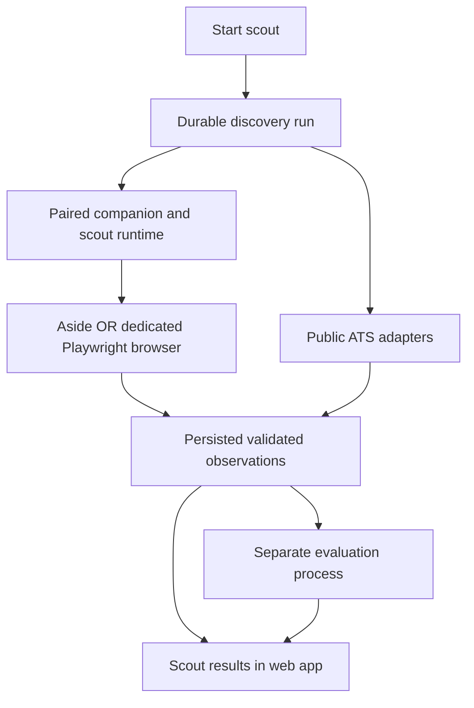

# Browser execution for the first scout

> **Historical research, not current implementation guidance (updated 2026-09-21).** Preserve the dated evidence and validation limits below. Recommendations for companions, local executors, managed workflow/browser services, Supabase, or platform-selected AI routes are superseded. Current decisions are web-only, self-hosted on the owner's VPS, and user-funded AI connections for OpenAI, Gemini, Anthropic, and xAI; hosted compatibility and authorization remain unproven gates. TypeSafe matching remains platform-funded. If user AI is unavailable, work waits for reconnect or an explicit manual account switch. See the current [decision index](../decisions/README.md) and [platform architecture](../architecture/overview.md).

[Research index](README.md) · [First scout](../delivery/steps/04-first-scout.md) · [Browser applications](browser-applications.md)

Research date: 2026-09-21. Status: recommendation for discussion, not an accepted implementation decision. Official documentation and repository scout flows were reviewed. No browser session, login, agent run, or live discovery benchmark was performed. The `aside` executable was unavailable on this shell's PATH; that does not establish whether the desktop application is installed.

## Current disposition

For public-only platform V1, the user selected a separate Chrome runtime on their existing VPS with open-source Browser Use. See [decision 0006](../decisions/0006-self-hosted-discovery-browser.md) and the [browser-worker design](../architecture/browser-workers.md). Aside/local-companion options below remain historical alternatives for this scope.

## Answer and recommendation

Follow-up: the user clarified that V1 serves hundreds of platform users and searches public sites only. The [backend scaling study](backend-browser-scaling.md) takes precedence for that scope: centralized public collection, with short-lived browsers where needed. The local/Aside paths below remain relevant to later authenticated workflows and the existing personal setup.

Yes: Job Kit can offer browser-assisted scouting like the current skill in Aside. Build on an existing browser engine and expose bounded browser tools to the scout runtime. A custom browser shell is optional.

Keep the accepted web-platform-plus-companion direction. The current step 04 explicitly starts with public ATS sources and separates persisted scout results from matching, so it does not need a browser dependency. For later browser sources, a dedicated Playwright profile remains the independent product path. For this user's existing workflow, first investigate an Aside adapter: its documented developer interfaces make reuse a credible experiment missing from the earlier research.

Three choices remain separate: which sources to search, which browser supplies access, and which agent interprets pages. A browser does not automatically supply the agent, skill execution, or durable storage.

## What the skill actually needs

The [search flow](../../skill/job-scout/references/flows/flow-search.md) uses browser-origin JSON requests and DOM interaction. It submits formulations, verifies query echoes, sets filters, paginates, and records route failures and interrupted surfaces. The [extract flow](../../skill/job-scout/references/flows/flow-extract.md) opens full postings, expands content, resolves canonical redirects, and validates facts. The [preflight](../../skill/job-scout/references/flows/flow-preflight.md) uses existing sessions and leaves passwords, OTPs, and 2FA to the user.

The app therefore needs navigation, inspection, scoped interaction, authorized source reads, login handoff, and evidence capture. Profile snapshots, validators, scoring, and persistence remain separate capabilities.

Preserve source scope, submitted-query evidence, unknown versus empty results, partial scans, full descriptions, and separate scout/match scores. A failed configured route must not silently switch to DOM. Moving public API reads out of page context and persisting discovery before matching are deliberate platform adaptations; this is not unchanged execution of the skill.

## Options

The ranking is for the general product; Aside is the most direct experiment for this user's setup. Tradeoffs are engineering judgments, not measured performance.

| Option           | Login and interaction                                                                     | Main dependency                                           | Fit                                        |
| ---------------- | ----------------------------------------------------------------------------------------- | --------------------------------------------------------- | ------------------------------------------ |
| Local Playwright | Dedicated persistent profile; user logs in and takes over its visible window              | Installed companion and awake device                      | Default independent adapter                |
| Aside adapter    | Installed browser through documented developer interfaces; session behavior needs testing | Aside installation, account, tools, and integration terms | First experiment for the existing workflow |
| Extension        | User-selected existing tab and its session                                                | Browser permissions and native bridge                     | Assisted extraction/import                 |
| Cloud browser    | Separate remote login; embedded interactive viewer                                        | Browser/model/network billing                             | Optional device-independent execution      |
| Electron shell   | Branded desktop interface with embedded pages and separate sessions                       | Distribution, updates, security, site compatibility       | Later integrated browser UX                |

### Reuse Aside

Aside documents CLI task execution and continuation, account selection, an `aside mcp` server, and `aside repl` for inspection, screenshots, downloads, and deterministic steps. These are integration surfaces to investigate without assuming an undocumented CDP port. [Aside developer guide](https://docs.aside.com/help/developers).

Two experiments are possible: delegate the scout task to Aside, or let Job Kit's agent use Aside's browser tools. The latter keeps workflow ownership clearer if the exposed tools can be restricted. Neither is validated here. Check installed-version capabilities, structured output, cancellation, account/session selection, skill loading, permissions, and commercial integration terms. MCP availability alone does not prove a restricted scout interface or reliable background execution.

### Use Playwright without building a browser product

Playwright can launch a visible persistent Chromium context using a dedicated user-data directory. The user logs into that profile; it does not inherit ordinary browser sessions. Serialize profile access and handle login expiry. [Playwright BrowserType](https://playwright.dev/docs/api/class-browsertype#browser-type-launch-persistent-context).

Do not depend on attaching to default Chrome profiles: since Chrome 136, remote-debugging switches require a nondefault data directory. This Chrome restriction does not establish Aside's behavior. [Chrome remote-debugging change](https://developer.chrome.com/blog/remote-debugging-port).

### Existing tabs and embedded browsers

An extension can receive temporary `activeTab` access after a user gesture. Same-origin navigation retains access; cross-origin navigation revokes it. Native messaging connects extensions to installed applications. This fits “read this posting” better than unattended multi-site searches with minimal permissions. [activeTab](https://developer.chrome.com/docs/extensions/develop/concepts/activeTab), [native messaging](https://developer.chrome.com/docs/extensions/develop/concepts/native-messaging).

A React page cannot inspect arbitrary other tabs or cross-origin DOM. Sites can also prohibit framing. Putting job boards in an iframe is not a general browser-control solution. [Same-origin policy](https://developer.mozilla.org/en-US/docs/Web/Security/Defenses/Same-origin_policy), [frame-ancestors](https://developer.mozilla.org/en-US/docs/Web/HTTP/Reference/Headers/Content-Security-Policy/frame-ancestors).

For a desktop browser inside Job Kit, Electron's `WebContentsView` displays third-party pages beside app UI. Job Kit would still own navigation, sessions, automation, takeover, downloads, and updates. Untrusted pages need sandboxing, disabled Node integration, context isolation, and validated IPC. Actual login compatibility requires testing. [WebContentsView](https://www.electronjs.org/docs/latest/api/web-contents-view), [Electron security](https://www.electronjs.org/docs/latest/tutorial/security).

For a browser inside the web app, Browserbase provides an embeddable interactive Live View of a remote browser. This embeds its viewer, not the target website directly, and does not inherit local cookies. The earlier [browser study](browser-applications.md) covers cloud profile and lifecycle tradeoffs. [Browserbase Live View](https://docs.browserbase.com/platform/browser/observability/session-live-view).

### Browser control and agent reasoning

Playwright supplies control. Stagehand adds model-assisted actions and extraction, with observe/act steps that can expose proposed actions for validation. Browser Use is another browser-agent implementation to benchmark. Neither replaces Job Kit's source policy, validation, recovery, or persistence. Browser compatibility alone proves nothing about reuse of an AI subscription. [Stagehand actions](https://docs.stagehand.dev/v3/basics/act), [Browser Use repository](https://github.com/browser-use/browser-use), [provider study](provider-connections.md).

## Proposed browser-enabled journey

This is a later extension of step 04's current public-source scope, not implemented behavior:

1. Select supported sources/search packs and start from the confirmed profile. Show source coverage and required device/connections.
2. Persist the run with profile/search revisions. Public adapters collect directly; assign browser work to the paired companion only for sources that need it.
3. Use the selected browser adapter. “Open search browser” exposes the dedicated local window. Aside remains external unless embedding support is separately verified.
4. On login or a challenge, pause agent interaction and request user takeover. Re-inspect page and account state on resume. Release execution capacity during long waits; the tab need not survive indefinitely.
5. Persist validated observations incrementally. Dispatch matching separately, retaining scout results even when matching is pending or fails.
6. Closing the web UI leaves the durable run intact. A sleeping device delays local work. Restart from recorded progress, revalidate browser state, and deduplicate results.

The cloud remains authoritative under the [execution contract](../architecture/execution.md). Browser-session lifetime is separate from run lifetime.

## Smallest useful proof

Greenhouse, Lever, and Ashby offer documented posting reads for known employer boards. These are not universal job search engines. The employer catalog in the current step 04 is essential; three adapters alone cannot reproduce all current search packs. [Greenhouse](https://docs.greenhouse.io/job-board.html), [Lever](https://github.com/lever/postings-api), [Ashby](https://developers.ashbyhq.com/docs/public-job-posting-api).

For browser coverage, test one permitted source with pagination and expandable descriptions through Playwright, and through Aside if its installed interface supports it. Use a controlled fixture for login/challenge/failure injection, followed by a permitted live read. Keep scout's list-only boundary.

Success requires:

- Submitted-query and complete-description evidence, with canonical redirect deduplication.
- Distinct expired-login, challenge, rate-limit, partial-scan, and empty-result outcomes.
- Retained observations and duplicate-free recovery after browser closure, worker interruption, and device reconnection.
- Agent interaction stops during takeover; resume checks current page/account state.
- Scout tools cannot apply, message, or access unrelated profiles. If generic browser/shell access defeats this restriction, the adapter fails the proof.
- Route failures remain visible rather than silently changing source or transport.

Measure extraction correctness, useful results, intervention rate, elapsed time, and browser/model usage. Technical access and source permission remain separate, as covered by [discovery research](job-discovery.md#identity-freshness-and-scheduling).

## Delivery implication

The current public-source first scout can ship without a custom browser or authenticated-board support. If parity with authenticated Aside search packs becomes a V1 requirement, explicitly expand the milestone to include an adapter plus connection, takeover, and recovery flows.

The new finding is an Aside adapter candidate, not a replacement for the accepted companion architecture. Electron, local browser streaming, cloud execution, and arbitrary-site coverage can wait until the browser proof establishes what users need.
